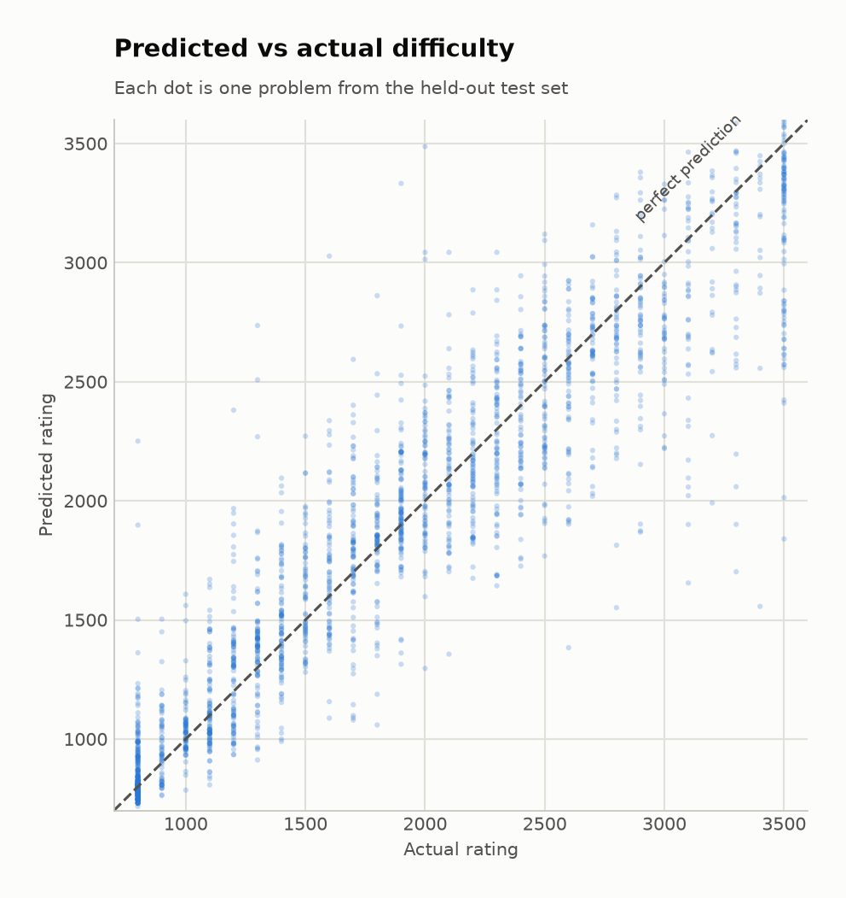
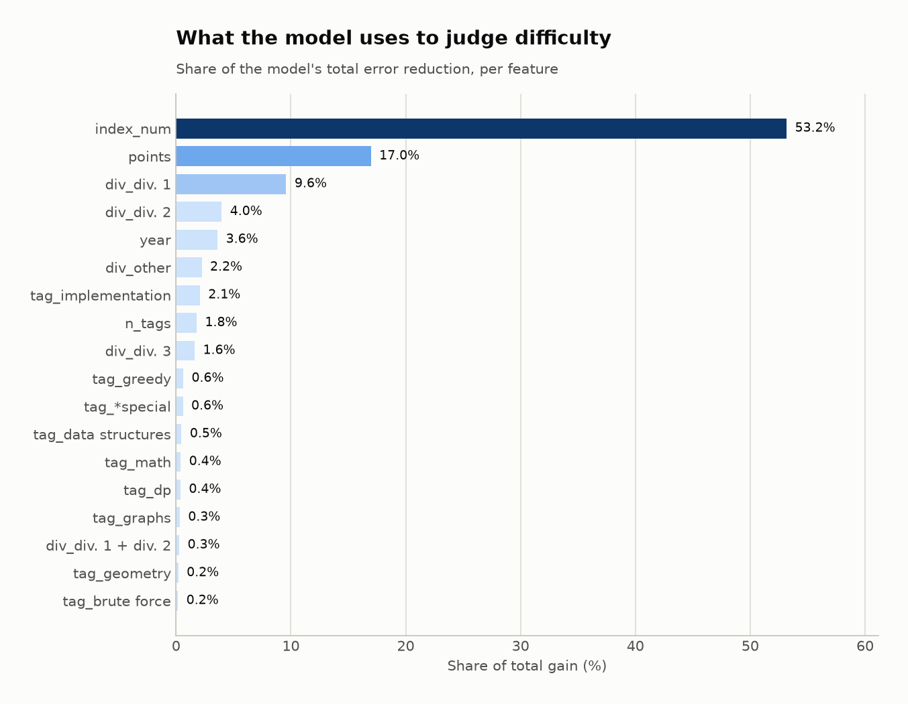
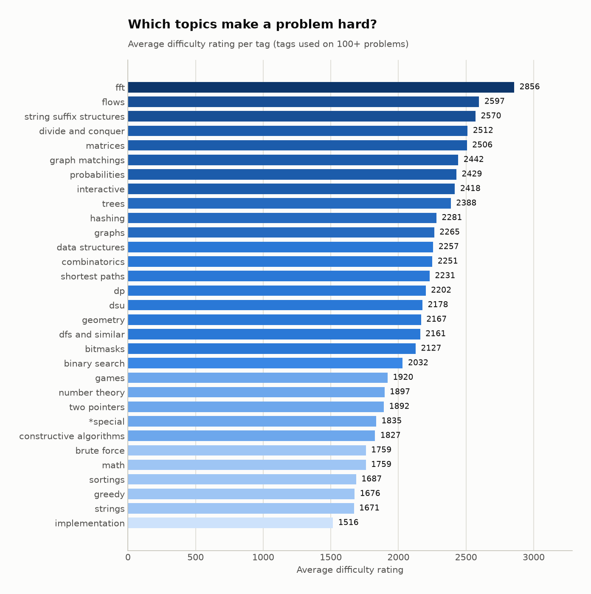
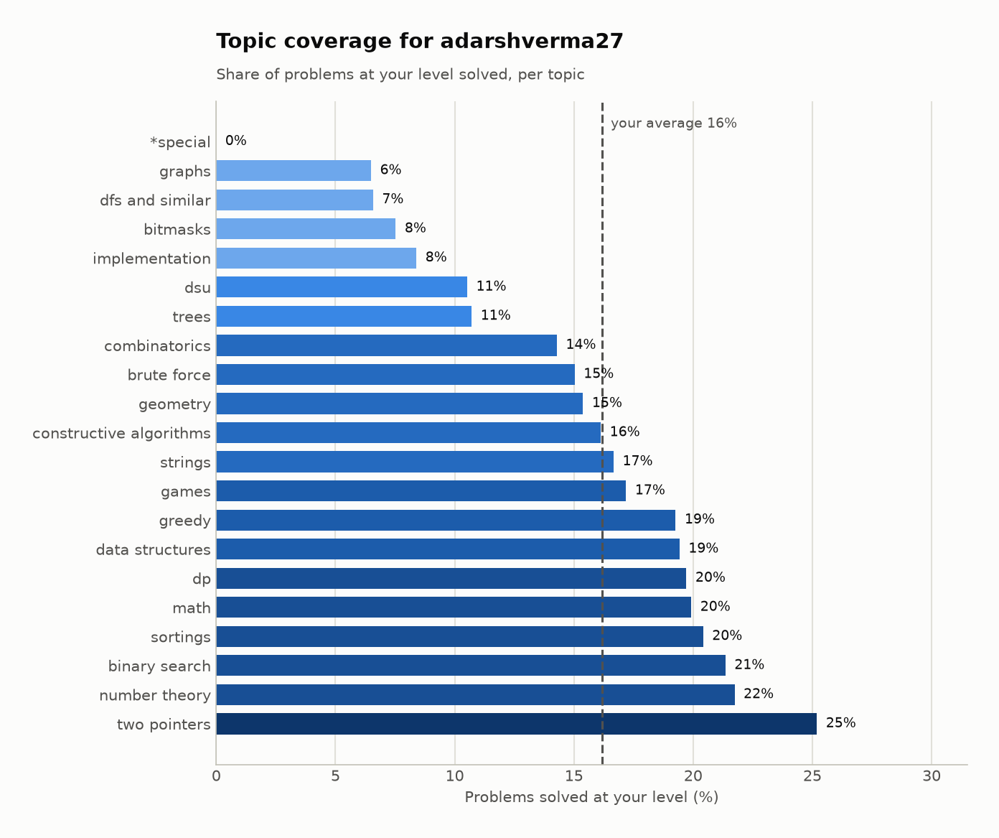

# CF-Coach — predicting Codeforces problem difficulty

Codeforces assigns every problem a difficulty rating from 800 to 3500, but only
*after* enough people have attempted it. Recent problems sit unrated for weeks.

This project predicts that rating from information available the moment a
problem is published — its topic tags, its position in the contest, and the
contest's division — and then uses the model to build a personalised practice
recommender.

Built from scratch against the live Codeforces API. No pre-packaged dataset.

---

## Results

Trained on **8,840** older problems, tested on **2,211** newer ones
(chronological split — see *Time-based split* below).

| Model | MAE ↓ | RMSE ↓ | R² ↑ |
|---|---|---|---|
| Baseline (always predict the mean) | 689.5 | 810.6 | 0.000 |
| Linear regression | 276.9 | 383.5 | 0.776 |
| **LightGBM** | **212.5** | **309.9** | **0.854** |

The final model predicts a problem's difficulty to within **213 rating points
on average — 69% better than the baseline**, and explains 85% of the variance.

For scale: 213 points is roughly the gap between a Div. 2 B and a Div. 2 C.

> Data is fetched live, so re-running may shift the numbers slightly as new
> contests are added and solve counts grow.



Predictions track the diagonal closely, with mild regression toward the mean at
both extremes — the model is slightly reluctant to commit to 800 or 3500.

---

## What the model learned



**The most interesting result in the project: topic tags barely matter.**

A problem's **position in the contest** accounts for **53%** of the model's
total error reduction. Add the contest's point value (17%) and its division
(~15%), and structural features explain the overwhelming majority. Every topic
tag combined contributes under 10%.

That is counterintuitive until you think about who creates the data: contest
setters *order problems by difficulty on purpose*. Position is not really a
feature about the problem — it is the setter's own difficulty judgment, already
encoded. The model is largely learning to read that judgment.

Tags still carry real signal on their own, though:



| Hardest topics | Avg rating | | Easiest topics | Avg rating |
|---|---|---|---|---|
| `fft` | 2861 | | `implementation` | 1516 |
| `flows` | 2597 | | `strings` | 1674 |
| `string suffix structures` | 2570 | | `greedy` | 1677 |
| `divide and conquer` | 2513 | | `sortings` | 1688 |
| `matrices` | 2505 | | `math` | 1759 |

---

## Two methodology decisions that mattered

### Time-based split

The train/test split is **chronological**, not random: the model trains on
older contests and is tested on newer ones.

A random split would let the model train on problems from the same contest it
is later tested on. Since problems within a contest share a setter, a
difficulty curve and a theme, that leaks information and inflates the score.
The honest test is the real task: rate problems that did not exist at training
time.

### Target leakage — a deliberate mistake, kept in the repo

`solved_count` (how many people solved a problem) is *enormously* predictive of
difficulty. Adding it improves MAE from 212.5 to **123.6**.

It is also useless, for two reasons:

1. Codeforces derives the official rating *from* how people performed, so
   predicting the rating from solve counts is circular.
2. A brand-new problem has no solve count — so a model depending on it cannot
   do the one job it was built for.

`train.py` runs this experiment on every run and prints both numbers, because
a score that improves suspiciously fast is the main warning sign of leakage.

---

## The recommender

The trained model earns its keep in `recommend.py`. Recent problems have no
official rating, so without predictions they could never be recommended — the
model rates all **305** unrated problems to bring them into the pool.

```
$ python recommend.py --handle YOUR_HANDLE

Your level:    1600   (75th percentile of what you solve)
Targeting:     1700-1900

--- Your weakest topics (you average 24% coverage at this level) ---
  dp                            9.1%  (12 of 132 solved)
  trees                        11.4%  (8 of 70 solved)
  ...
```

**Measuring weakness correctly took two attempts.** The obvious metric — "what
difficulty have I reached in each topic?" — is broken, because topics differ
enormously in intrinsic difficulty. Ranking by it returns `implementation`,
`greedy` and `sortings` for *everybody*, since those problems are just easier.

The fix is **coverage**: within your own difficulty band, what share of each
topic's problems have you solved? A topic where you have cleared 9% while
averaging 24% elsewhere is a real gap, whatever the topic's absolute
difficulty.



---

## Running it

```bash
python -m venv .venv && source .venv/bin/activate
pip install -r requirements.txt

python fetch_data.py --handle YOUR_HANDLE   # pull from the Codeforces API
python explore.py                           # charts 01-04
python train.py                             # trains models, charts 05-06
python recommend.py --handle YOUR_HANDLE    # chart 07 + recommendations
```

## Project structure

```
fetch_data.py   Downloads problems, contests and submissions from the API
explore.py      Exploratory charts — what the data looks like before modelling
train.py        Feature building, the three models, evaluation, leakage demo
recommend.py    Skill profiling and problem recommendation
style.py        Shared chart styling
```

## Data

All data comes from the [Codeforces API](https://codeforces.com/apiHelp)
(public, no authentication): 11,356 problems across 2,139 contests, of which
11,051 carry an official difficulty rating.

## Limitations & next steps

- **No problem statements.** The API exposes only tags and metadata, not the
  text. Statement length and constraint sizes (`n ≤ 10^5` vs `n ≤ 10^18`) would
  likely be strong signals — scraping them is the obvious next step.
- **Position dominates.** Because `index_num` is so powerful, the model is
  weakest exactly where it would be most useful: a standalone problem with no
  contest context.
- **Tag noise.** Codeforces tags are community-assigned and inconsistent.
- **The recommender is not evaluated.** Difficulty prediction is measured
  properly; the recommendations are a heuristic on top, with no ground truth to
  score against. Validating them would need a held-out period of a user's real
  solve history.
